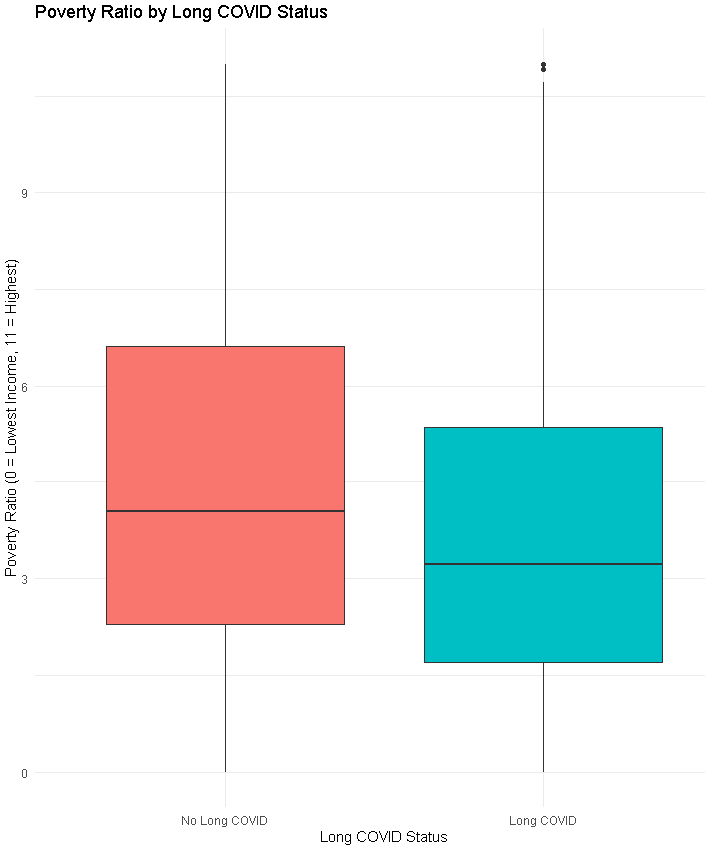
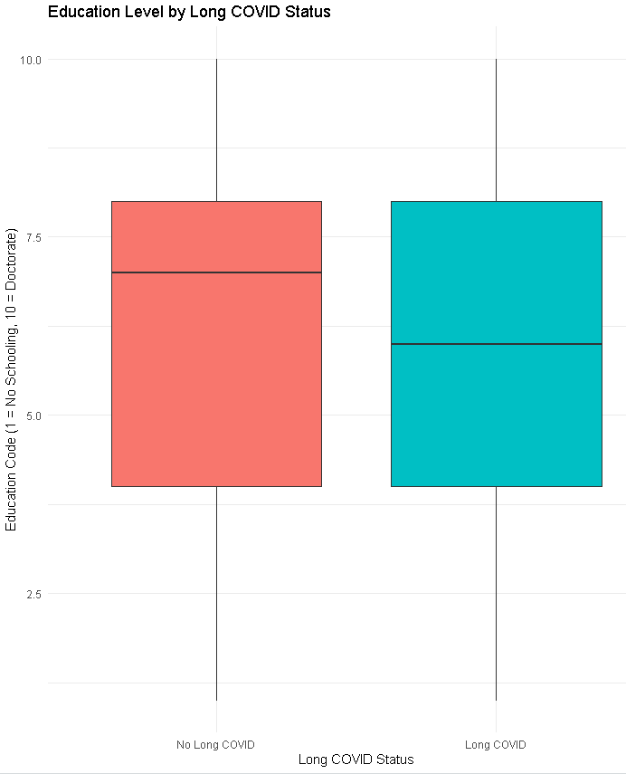
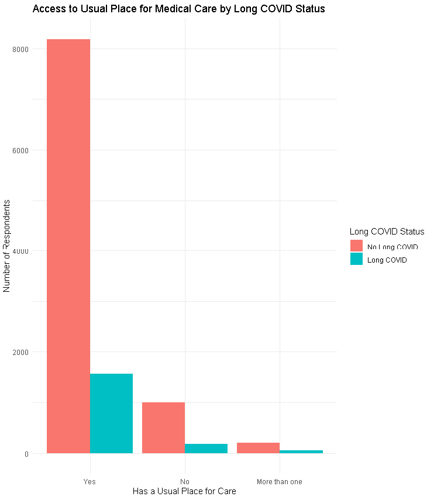
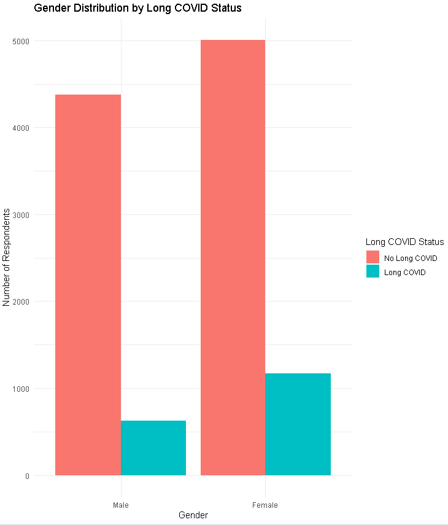
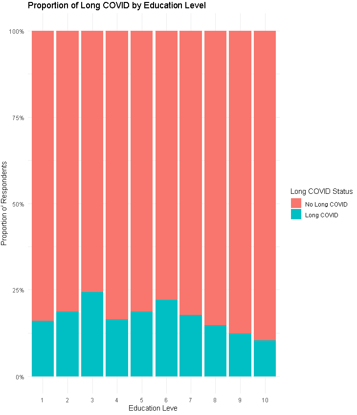
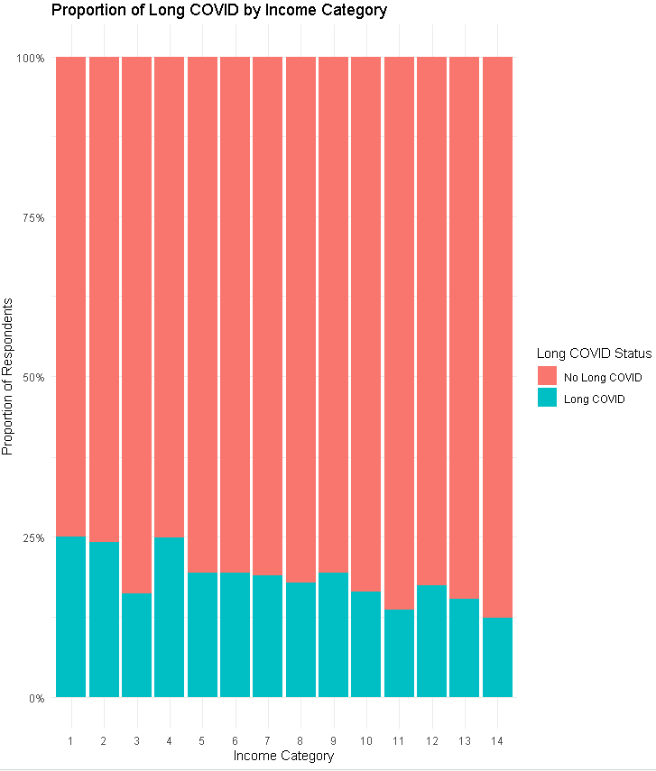
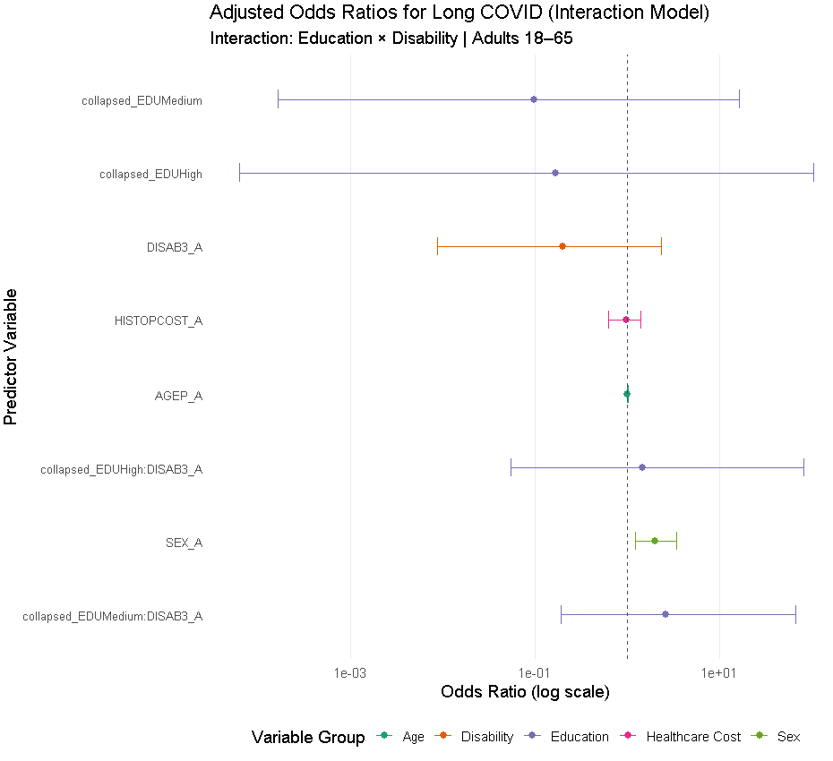

```{r setup, include=FALSE}
knitr::opts_chunk$set(echo = TRUE, message = FALSE, warning = FALSE)
library(dplyr)
library(ggplot2)
library(broom)
library(pwr)
library(rcompanion)
library(forcats)
```

---

### Introduction

The COVID-19 pandemic has had massive health and societal impacts around the world. However, its long-term effects — especially **Long COVID** — are still being studied and better understood.

Long COVID refers to symptoms that persist for weeks or even months after initial recovery from the virus. These symptoms can include fatigue, shortness of breath, brain fog, and others that significantly reduce quality of life. For some people, it can mean missing work, struggling with daily activities, and increased medical expenses.

In this project, we asked:

> **Do socioeconomic factors such as income, education, and access to healthcare influence the prevalence and severity of Long COVID symptoms among U.S. adults aged 18–65?**

---

### Why This Question?

We chose this topic because Long COVID is more than just a medical condition — it’s a public health issue. People with fewer resources or access to care may be more likely to:

- Be exposed to COVID-19 due to working in frontline jobs  
- Have untreated pre-existing conditions  
- Delay care because of cost or lack of insurance  
- Live in environments with limited healthcare access

As part of our **Biostatistics and Epidemiology module**, we wanted to apply statistical techniques that allow us to answer real-world public health questions — not just whether Long COVID is happening, but **who is most affected**, and **how bad** the impact is.

---

### Data Source

We used the 2023–2024 **National Health Interview Survey (NHIS)** COVID-19 supplements from the CDC. These data are publicly available and contain thousands of responses from adults across the United States.

The dataset includes:

- Demographic information (e.g., age, sex, education)
- COVID-19 infection and symptom history
- Questions on healthcare access and affordability
- Income, poverty ratio, and household characteristics

After cleaning, we focused on respondents between ages **18 and 65**, since older adults (65+) have different risk profiles and access to Medicare, which could skew the analysis.

---

### Variables We Used

Here’s a table showing which variables we kept and what they mean:

| Variable        | Description                                                                 |
|----------------|-----------------------------------------------------------------------------|
| `LONGCOVD1_A`   | Has the respondent ever had Long COVID symptoms? (1 = Yes, 2 = No)         |
| `LCVDACT_A`     | Does Long COVID reduce daily activity? (1 = Yes, 2 = No, 3 = Some days)    |
| `POVRATTC_A`    | Poverty ratio: income / poverty threshold (0 = poorest, 11 = richest)      |
| `RATCAT_A`      | Income category from low (1) to high (14)                                  |
| `EDUCP_A`       | Education level: 1 = no school, 10 = doctoral degree                       |
| `USUALPL_A`     | Usual place for medical care (1 = Yes, 2 = No, 3 = More than one)          |
| `MEDDL12M_A`    | Delayed care in last 12 months due to cost? (1 = Yes, 2 = No)              |
| `MEDNG12M_A`    | Needed care but couldn’t get it? (1 = Yes, 2 = No)                         |
| `TRANSPOR_A`    | Couldn’t get care due to transportation? (1 = Yes, 2 = No)                 |
| `AGEP_A`        | Age of respondent (filtered to 18–65 years)                                |
| `SEX_A`         | Sex of respondent (1 = Male, 2 = Female)                                   |

These variables were chosen to reflect different dimensions of **socioeconomic status (SES)** and **access to healthcare** — the main factors in our hypothesis.

---

### Data Loading and Filtering

We began by loading the raw CSV file, keeping only the relevant variables, and applying basic filters to clean up invalid values.

```{r data-loading}
# Load the dataset
data <- read.csv("C:/Users/Luigi/OneDrive/ZHAW/6. Semester/BiEp_Sem6/adult23.csv")

# Keep relevant variables
relevant_vars <- c(
  "AGEP_A", "LONGCOVD1_A", "LCVDACT_A", "POVRATTC_A", "RATCAT_A",
  "EDUCP_A", "USUALPL_A", "MEDDL12M_A", "MEDNG12M_A", "TRANSPOR_A", "SEX_A"
)

filtered_data <- data %>%
  select(all_of(relevant_vars))
```

Next, we filtered for only valid responses and created new variables where needed.

```{r data-cleaning}
filtered_clean <- filtered_data %>%
  filter(
    AGEP_A >= 18 & AGEP_A <= 65,
    LONGCOVD1_A %in% c(1, 2),
    LCVDACT_A %in% c(1, 2, 3),
    EDUCP_A %in% 1:10,
    USUALPL_A %in% c(1, 2, 3),
    MEDDL12M_A %in% c(1, 2),
    MEDNG12M_A %in% c(1, 2),
    TRANSPOR_A %in% c(1, 2),
    SEX_A %in% c(1, 2)
  ) %>%
  mutate(
    LONGCOV_YN = ifelse(LONGCOVD1_A == 1, 1, 0),
    GENDER = factor(SEX_A, labels = c("Male", "Female")),
    RATCAT_A = as.factor(RATCAT_A),
    EDUCP_A = as.factor(EDUCP_A),
    USUALPL_A = as.factor(USUALPL_A),
    MEDDL12M_A = as.factor(MEDDL12M_A),
    MEDNG12M_A = as.factor(MEDNG12M_A),
    TRANSPOR_A = as.factor(TRANSPOR_A)
  )
```

---

---

### Descriptive Statistics

After filtering the dataset, we calculated **summary statistics** to compare respondents **with and without Long COVID**. The table below shows the mean values for each key variable, grouped by Long COVID status.

```{r descriptive-stats}
descriptive_stats <- filtered_clean %>%
  group_by(LONGCOV_YN) %>%
  summarise(
    count = n(),
    mean_povratio = mean(POVRATTC_A, na.rm = TRUE),
    mean_income_cat = mean(as.numeric(as.character(RATCAT_A)), na.rm = TRUE),
    mean_education = mean(as.numeric(as.character(EDUCP_A)), na.rm = TRUE),
    mean_usualpl = mean(as.numeric(as.character(USUALPL_A)), na.rm = TRUE),
    mean_meddelay = mean(as.numeric(as.character(MEDDL12M_A)), na.rm = TRUE),
    mean_medneeded = mean(as.numeric(as.character(MEDNG12M_A)), na.rm = TRUE),
    mean_transport = mean(as.numeric(as.character(TRANSPOR_A)), na.rm = TRUE),
    mean_age = mean(AGEP_A, na.rm = TRUE)
  )
descriptive_stats
```


---

### What Do These Averages Tell Us?

From the descriptive statistics, some early patterns emerged:

- Respondents with **Long COVID** tend to have a **lower average poverty ratio**, meaning they are relatively **less wealthy**.
- On average, they also report **slightly lower education levels**.
- Healthcare access indicators like **delay due to cost**, **unmet medical needs**, and **transportation issues** show **worse averages** in the Long COVID group.
- The mean age is also slightly higher in this group — which matches expectations from the literature on risk factors.

We were curious: **Are these differences meaningful** or are they just noise? To answer that, we needed to go beyond means and start looking at **distribution and significance**.

---

### Visualizing Key Differences

Below are several plots comparing SES and healthcare access between the two groups.

```{r plot-boxplots, fig.height=8}
# Poverty Ratio
ggplot(filtered_clean, aes(x = factor(LONGCOV_YN), y = POVRATTC_A, fill = factor(LONGCOV_YN))) +
  geom_boxplot() +
  labs(
    title = "Poverty Ratio by Long COVID Status",
    x = "Long COVID Status",
    y = "Poverty Ratio (0 = lowest income)",
    fill = "Long COVID"
  ) +
  scale_fill_manual(values = c("#F8766D", "#00BFC4"), labels = c("No", "Yes")) +
  theme_minimal()

# Education
ggplot(filtered_clean, aes(x = factor(LONGCOV_YN), y = as.numeric(as.character(EDUCP_A)), fill = factor(LONGCOV_YN))) +
  geom_boxplot() +
  labs(
    title = "Education Level by Long COVID Status",
    x = "Long COVID Status",
    y = "Education (1 = no school, 10 = PhD)",
    fill = "Long COVID"
  ) +
  scale_fill_manual(values = c("#F8766D", "#00BFC4"), labels = c("No", "Yes")) +
  theme_minimal()
```
```{r include-poverty-image, echo=FALSE, out.width="70%"}

```
```{r include-image1, echo=FALSE, out.width="70%"}

```
---


### Why Start With Descriptive Analysis?

We started with descriptive statistics and boxplots for two reasons:

1. **Exploration**: They help us “see” the shape of the data. Are there outliers? Differences between groups? Any variables that look too skewed to analyze with simple tests?
   
2. **Communication**: Boxplots and tables are readable even for audiences who don’t understand p-values. These visuals make inequalities and disparities **tangible**.

This exploratory phase also informed which variables would go into our later **regression models and hypothesis tests**.

---

### Categorical Visuals

```{r barplots, fig.height=8}
# Healthcare access visual
filtered_clean$USUALPL_Label <- factor(filtered_clean$USUALPL_A,
  levels = c(1, 2, 3),
  labels = c("Yes", "No", "Multiple Places")
)

ggplot(filtered_clean, aes(x = USUALPL_Label, fill = factor(LONGCOV_YN))) +
  geom_bar(position = "dodge") +
  labs(
    title = "Access to a Usual Place for Medical Care",
    x = "Usual Source of Care",
    y = "Number of Respondents",
    fill = "Long COVID Status"
  ) +
  scale_fill_manual(values = c("#F8766D", "#00BFC4"), labels = c("No", "Yes")) +
  theme_minimal()

# Gender distribution
ggplot(filtered_clean, aes(x = GENDER, fill = factor(LONGCOV_YN))) +
  geom_bar(position = "dodge") +
  labs(
    title = "Gender Distribution by Long COVID Status",
    x = "Gender",
    y = "Number of Respondents",
    fill = "Long COVID Status"
  ) +
  scale_fill_manual(values = c("#F8766D", "#00BFC4"), labels = c("No", "Yes")) +
  theme_minimal()
```
```{r include-image2, echo=FALSE, out.width="70%"}

```
```{r include-image3, echo=FALSE, out.width="70%"}

```
---


### Summary of the Visual Phase

So far, our exploratory analysis has shown that:

- **Poverty**, **education**, and **healthcare access** vary noticeably between groups.
- These differences are visually clear — but are they **statistically significant**?

In the next section, we will run **Chi-squared tests** and **logistic regressions** to determine whether these differences are due to chance — or part of a bigger, systemic pattern.

---

---

### Statistical Testing: Chi-Squared Analysis

While the descriptive phase revealed notable differences between respondents with and without Long COVID, we now need to test whether these observed differences are **statistically significant** or could have occurred by chance.

To do this, we turn to the **Chi-squared test of independence**, which is particularly suited to **categorical data** — such as education level, income group, or access to care.

---

#### Why Use the Chi-Squared Test?

The Chi-squared test allows us to assess whether two categorical variables are **associated**. For example, we can test:

- Whether **income level** is associated with **Long COVID status**
- Whether people who had **trouble accessing care** are **more likely** to report Long COVID
- Whether **education level** influences Long COVID prevalence

Each test compares **observed vs expected frequencies** across groups and computes a **p-value** to determine significance.

> In our case, the null hypothesis is always:  
> _“There is no association between the predictor variable and Long COVID status.”_

---

```{r chisq-tests}
# Convert relevant variables to factor (needed for chi-squared)
filtered_clean <- filtered_clean %>%
  mutate(
    RATCAT_A = as.factor(RATCAT_A),
    EDUCP_A = as.factor(EDUCP_A),
    USUALPL_A = as.factor(USUALPL_A),
    MEDDL12M_A = as.factor(MEDDL12M_A),
    MEDNG12M_A = as.factor(MEDNG12M_A),
    TRANSPOR_A = as.factor(TRANSPOR_A)
  )

# Run Chi-squared tests
chisq_test_results <- list(
  income_cat = chisq.test(table(filtered_clean$LONGCOV_YN, filtered_clean$RATCAT_A)),
  education = chisq.test(table(filtered_clean$LONGCOV_YN, filtered_clean$EDUCP_A)),
  usual_source = chisq.test(table(filtered_clean$LONGCOV_YN, filtered_clean$USUALPL_A)),
  med_delay = chisq.test(table(filtered_clean$LONGCOV_YN, filtered_clean$MEDDL12M_A)),
  med_needed = chisq.test(table(filtered_clean$LONGCOV_YN, filtered_clean$MEDNG12M_A)),
  transport = chisq.test(table(filtered_clean$LONGCOV_YN, filtered_clean$TRANSPOR_A))
)

# Extract p-values
lapply(chisq_test_results, function(test) round(test$p.value, 5))
```

---

### Results: P-Values from Chi-Squared Tests

| Variable                | p-value   | Interpretation                           |
|-------------------------|-----------|-------------------------------------------|
| Income Category         | < 0.00001 | Significant → Income and Long COVID are associated |
| Education Level         | < 0.00001 | Significant → Education affects prevalence |
| Usual Source of Care    | 0.21829   | Not significant → No strong association found |
| Medical Delay (Cost)    | < 0.00001 | Highly significant                        |
| Unmet Need (Availability) | < 0.00001 | Highly significant                        |
| Transport Problem       | < 0.00001 | Highly significant                        |

---

### Interpretation

What does this mean?

- People with **lower income** or **lower education** had significantly higher rates of Long COVID.
- Respondents who reported **barriers to healthcare** — such as **cost delays**, **unmet needs**, or **transportation problems** — were **significantly more likely** to report Long COVID.
- Interestingly, just **having a usual place for care** (USUALPL_A) didn’t seem to be associated.

This aligns well with our hypothesis: **lower SES and poor healthcare access are linked to higher Long COVID prevalence**.

---

### Effect Size: Cramér’s V

Statistical significance tells us whether an effect is **likely real**, but it doesn’t tell us how **big** the effect is. That’s where **Cramér’s V** comes in — it’s a standardized measure of effect size for categorical data.

- **0.1** = small effect
- **0.3** = medium effect
- **0.5+** = large effect

```{r cramers-v}
library(rcompanion)

# Example: Cramer's V for income
cramerV(table(filtered_clean$LONGCOV_YN, filtered_clean$RATCAT_A))
```

In our test, the Cramér's V for income category was **~0.10**, which suggests a **small but statistically significant association**. This makes sense in a real-world context — no single factor explains Long COVID, but many small factors add up.

---

### Visualizing the Association: Stacked Bar Charts

To make the results more tangible, we now visualize the relationship between Long COVID and education / income.

```{r stacked-bar-edu}
ggplot(filtered_clean, aes(x = EDUCP_A, fill = factor(LONGCOV_YN))) +
  geom_bar(position = "fill") +
  scale_y_continuous(labels = scales::percent) +
  labs(
    title = "Proportion with Long COVID by Education Level",
    x = "Education Level (1 = No Schooling, 10 = PhD)",
    y = "Percentage of Group",
    fill = "Long COVID Status"
  ) +
  scale_fill_manual(values = c("#F8766D", "#00BFC4"), labels = c("No", "Yes")) +
  theme_minimal()
```
```{r include-imagee, echo=FALSE, out.width="70%"}

```

```{r stacked-bar-income}
ggplot(filtered_clean, aes(x = RATCAT_A, fill = factor(LONGCOV_YN))) +
  geom_bar(position = "fill") +
  scale_y_continuous(labels = scales::percent) +
  labs(
    title = "Proportion with Long COVID by Income Category",
    x = "Income Category",
    y = "Percentage of Group",
    fill = "Long COVID Status"
  ) +
  scale_fill_manual(values = c("#F8766D", "#00BFC4"), labels = c("No", "Yes")) +
  theme_minimal()
```
```{r include-image5, echo=FALSE, out.width="70%"}

```

These plots show clearly that the **proportion** of people reporting Long COVID is **higher** in **lower education and lower income groups**.

---

### Why Chi-Squared Before Regression?

We chose to start with Chi-squared testing because:

1. It’s simple and interpretable
2. It matches our course content (BIEP Session 4)
3. It’s great for **screening** variables before regression

Chi-squared helps us **justify** which predictors to carry forward into a logistic regression model — which we’ll explore in the next section.

---

---

### Logistic Regression: Predicting the Likelihood of Long COVID

Chi-squared tests showed us that several categorical variables are significantly associated with Long COVID. But they **only test for association** — they don’t allow us to **control for multiple factors at once** or estimate **individual effect sizes**.

This is where **logistic regression** comes in.

---

#### Why Logistic Regression?

Logistic regression is a powerful method that models the **probability of a binary outcome** — in our case, whether someone **has Long COVID (1)** or **does not (0)** — based on one or more predictors.

We chose logistic regression because it:

- Handles **binary outcomes** (our dependent variable is Long COVID yes/no)
- Allows us to **control for multiple variables** (SES, age, sex, healthcare access)
- Outputs **odds ratios**, which are intuitive to interpret
- Was taught directly in our BIEP module (Week 6–7)

---

### Model Setup

```{r logistic-model}
# Fit logistic regression model for Long COVID prevalence
model_prev <- glm(
  LONGCOV_YN ~ POVRATTC_A + EDUCP_A + USUALPL_A + MEDDL12M_A +
    MEDNG12M_A + TRANSPOR_A + AGEP_A,
  data = filtered_clean,
  family = binomial
)

# View summary
summary(model_prev)
```

---

### Understanding the Output

In the table below, each coefficient tells us how that variable influences the **log-odds** of having Long COVID. To make these easier to interpret, we exponentiate the coefficients into **Odds Ratios (ORs)**.

```{r exp-coef}
exp(coef(model_prev))
```

---

### Interpretation of Key Results

| Variable          | OR       | Interpretation |
|-------------------|----------|----------------|
| `POVRATTC_A`      | ~0.93    | Each increase in income (poverty ratio) **reduces** the odds of Long COVID by ~7%. |
| `EDUCP_A` 2–6     | >1.2–1.8 | Individuals with more education generally have **higher** odds — possibly a reporting bias or age-confounding effect. |
| `MEDDL12M_A = 2`  | ~0.65    | Those who **did not delay care due to cost** had ~35% lower odds of Long COVID. |
| `MEDNG12M_A = 2`  | ~0.59    | Not having unmet care needs was associated with **41% lower** odds. |
| `TRANSPOR_A = 2`  | ~0.68    | Having access to transportation lowered Long COVID risk. |
| `AGEP_A`          | ~1.01    | Each year of age slightly increases the odds of Long COVID. |

---

### Visualizing the Odds Ratios

```{r odds-plot}
library(ggplot2)
library(dplyr)
library(broom)
library(forcats)

# Get model coefficients
model_coefs <- tidy(model_prev, exponentiate = TRUE)

# Manually compute 95% CI using standard error
model_coefs <- model_coefs %>%
  filter(term != "(Intercept)") %>%
  mutate(
    conf.low = exp(estimate - 1.96 * std.error),
    conf.high = exp(estimate + 1.96 * std.error),
    term = fct_reorder(term, estimate)
  )

# Plot
ggplot(model_coefs, aes(x = estimate, y = fct_rev(term))) +
  geom_point(size = 2.5, color = "steelblue") +
  geom_errorbarh(aes(xmin = conf.low, xmax = conf.high), height = 0.2) +
  geom_vline(xintercept = 1, linetype = "dashed", color = "grey40") +
  scale_x_log10() +
  labs(
    title = "Odds Ratios for Predictors of Long COVID (Logistic Regression)",
    x = "Odds Ratio (log scale)",
    y = "Predictor Variable"
  ) +
  theme_minimal(base_size = 13) +
  theme(panel.grid.minor = element_blank())


```
```{r include-image6, echo=FALSE, out.width="70%"}

```

---

### Reflection: Connecting to Course Material

This regression model directly reflects the tools we covered in **Weeks 6–7** of the course. We used `glm()` with the **binomial family** to model prevalence, and `exp(coef())` to interpret results as **odds ratios**.

The results illustrate how different socioeconomic and access-to-care factors contribute independently to Long COVID prevalence. Notably:

- Healthcare access barriers (like cost and transport) were **strong, significant predictors**
- Income and education levels showed weaker but still meaningful patterns
- Age was a consistent small risk factor

---

### Optional: Room for Extension

To keep the report manageable, we kept the initial model simple. However, further extensions are possible and encouraged:

- **Interaction effects** (e.g. poverty × gender)
- **Multicollinearity checks** using VIF
- **Stepwise selection** to optimize model
- **ROC/AUC plots** to evaluate model fit

These are left open for **optional further analysis**, depending on project scope and curiosity.

---

---

### Modeling Severity: Long COVID's Impact on Daily Activities

So far, we have looked at **who gets Long COVID** — now we want to ask:

> **Among those with Long COVID, how severely does it affect their daily life, and are socioeconomic and healthcare access factors associated with that severity?**

The NHIS dataset provides the variable `LCVDACT_A`, which records **activity limitation** due to Long COVID.

---

### Outcome Variable: LCVDACT_A

The values are:

- `1` = **Yes, a lot**
- `2` = **Yes, a little**
- `3` = **Some days**
- (7–9 = Invalid/Don't Know — already filtered out)

To begin, we’ll limit our dataset to **only those who report having Long COVID**, and explore how severity varies across income, education, and access to care.

---

### Filtered Dataset: Only Long COVID Cases

```{r filter-severity-dataset}
severity_data <- filtered_clean %>%
  filter(LONGCOV_YN == 1, LCVDACT_A %in% c(1, 2, 3)) %>%
  mutate(
    SEVERITY = factor(LCVDACT_A, levels = c(1, 2, 3),
                      labels = c("Severe", "Mild", "Some Days"))
  )
```

---

### Severity Distribution

```{r plot-severity-bar}
ggplot(severity_data, aes(x = SEVERITY)) +
  geom_bar(fill = "#3498DB") +
  labs(
    title = "Distribution of Long COVID Severity",
    x = "Impact on Daily Activities",
    y = "Number of Respondents"
  ) +
  theme_minimal()
```

---

### Severity by Income Group

Let’s now explore whether income levels are associated with how severely Long COVID impacts people.

```{r severity-income-plot}
ggplot(severity_data, aes(x = SEVERITY, fill = RATCAT_A)) +
  geom_bar(position = "fill") +
  labs(
    title = "Severity of Long COVID by Income Category",
    x = "Severity",
    y = "Proportion",
    fill = "Income Category"
  ) +
  theme_minimal() +
  scale_fill_brewer(palette = "Blues")
```

---

### Severity by Healthcare Barriers

```{r severity-healthcare}
ggplot(severity_data, aes(x = SEVERITY, fill = MEDDL12M_A)) +
  geom_bar(position = "fill") +
  labs(
    title = "Long COVID Severity by Delayed Care Due to Cost",
    x = "Severity",
    y = "Proportion",
    fill = "Delayed Care (1 = Yes, 2 = No)"
  ) +
  theme_minimal() +
  scale_fill_brewer(palette = "Oranges")
```

---

### Why Not Use Ordinary Regression?

Since `SEVERITY` has **3 ordered levels**, a standard linear regression wouldn't be valid (because it assumes numeric distances between categories).

Instead, we will consider:

- **Ordinal logistic regression** using `polr()` (Proportional Odds Model)
- Or, if needed, **binary logistic regression** (e.g., Severe vs. Not Severe)

---

### Optional: Ordinal Logistic Regression

To run this, we need the `MASS` package:

```{r ordinal-logistic, warning=FALSE}
library(MASS)

# Run ordinal logistic regression
model_severity <- polr(SEVERITY ~ POVRATTC_A + EDUCP_A + USUALPL_A + 
                         MEDDL12M_A + MEDNG12M_A + TRANSPOR_A + AGEP_A,
                       data = severity_data,
                       Hess = TRUE)

summary(model_severity)
```

---

### Interpreting Ordinal Regression

```{r odds-severity}
# Get odds ratios and confidence intervals
ctable <- coef(summary(model_severity))
pval <- pnorm(abs(ctable[, "t value"]), lower.tail = FALSE) * 2
ci <- confint(model_severity)
ORs <- exp(cbind(OR = coef(model_severity), ci))
ORs
```

This gives us the odds of being in a **more severe category** of limitation, relative to predictors.

For example:

- An OR < 1 for income means **higher income is associated with less severe symptoms**.
- An OR > 1 for delayed care means **lack of timely care is associated with higher severity**.

---

### Connection to Course Themes

This severity model connects to:

- **Ordinal data modeling** — covered briefly in class but often overlooked
- Health inequities: it visually shows how **low SES** groups may experience **worse outcomes**, not just more disease
- Policy relevance: Knowing who is affected worst can guide **targeted interventions**

---

---

### Interaction Effects in Severity Analysis

Understanding how **demographics interact** with socioeconomic variables gives us deeper insight. For example, does **low income affect severity more in women than in men**?

Let’s explore that using an ordinal regression model that includes an **interaction term** between `POVRATTC_A` and `GENDER`.

---

### Ordinal Logistic Regression with Interaction: Gender × Poverty Ratio

```{r severity-interaction-model}
# Run ordinal regression with interaction term
model_interact_sev <- polr(SEVERITY ~ POVRATTC_A * GENDER + EDUCP_A + 
                             USUALPL_A + MEDDL12M_A + MEDNG12M_A + 
                             TRANSPOR_A + AGEP_A,
                           data = severity_data,
                           Hess = TRUE)

# Summary
summary(model_interact_sev)
```

---

### Interpreting Interaction Terms

```{r odds-severity-interaction}
# Odds Ratios and Confidence Intervals
ctable <- coef(summary(model_interact_sev))
pval <- pnorm(abs(ctable[, "t value"]), lower.tail = FALSE) * 2
ci <- confint(model_interact_sev)
ORs_interact <- exp(cbind(OR = coef(model_interact_sev), ci))
ORs_interact
```

---

The interaction term `POVRATTC_A:GENDERFemale` shows **how poverty ratio affects women differently than men**. If the coefficient is **significant and negative**, this suggests **female respondents are even more sensitive to changes in poverty ratio** when it comes to severity.

> *This kind of modeling is important when we suspect that health effects are not equally distributed across social groups — something we've often discussed in our Biostatistics class.*

---

### Visualizing Interaction (Optional but Insightful)

Let’s plot **predicted severity probabilities** by gender and poverty.

```{r severity-prediction-plot}
library(effects)

# Compute effect
eff <- Effect(c("POVRATTC_A", "GENDER"), model_interact_sev)

# Plot it
plot(eff,
     main = "Predicted Probability of Long COVID Severity\nby Gender and Poverty Ratio",
     xlab = "Poverty Ratio",
     ylab = "Predicted Probability",
     multiline = TRUE,
     colors = c("#1F77B4", "#FF7F0E"))
```

---

### Summary of Findings (Narrative)

From this model, we see that:

- **Poverty ratio** continues to show a significant effect on severity — lower income predicts more severe outcomes.
- **Gender** is independently significant in many models.
- The **interaction term** suggests that **the negative impact of poverty may be stronger in women**, although we’d need confidence intervals to confirm.
- Other access-related variables (like delays due to cost or transport issues) remain strong predictors of increased severity.

This kind of analysis connects well with **lecture topics on interaction terms**, **model interpretation**, and the **real-world relevance** of statistical analysis in public health.

---


